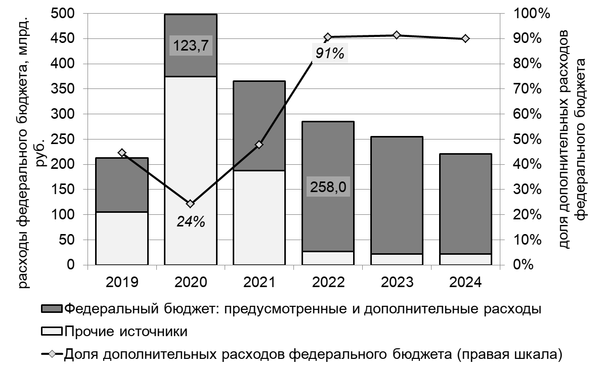
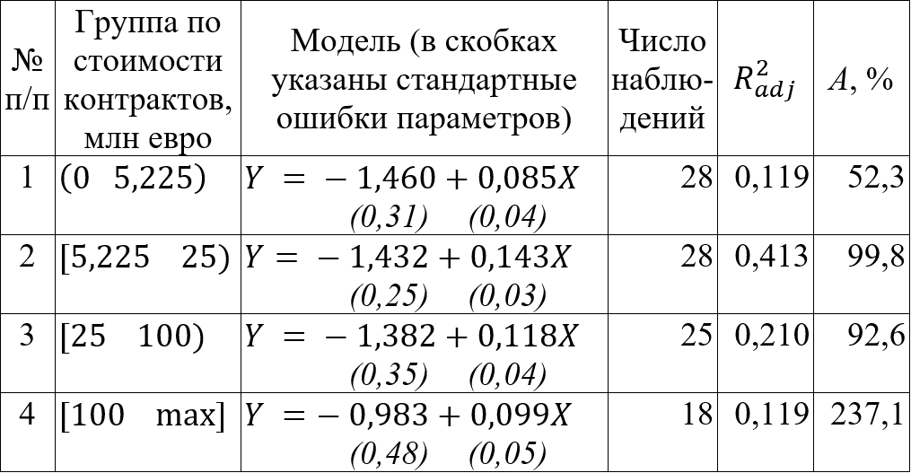
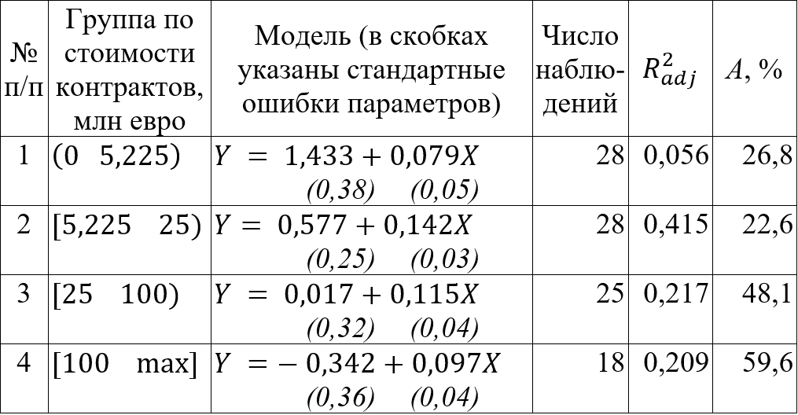

---
output:
  xaringan::moon_reader:
    css: ["../css/guu-slides-theme.css"]
    seal: false
    nature:
      ratio: '16:9'
      countIncrementalSlides: false
---

```{r setup, include=FALSE}
options(htmltools.dir.version = FALSE)

library('knitr')

```

class: inverse, center, middle  
background-image: url(../images/title_GERB-GUU_16-9.png)
background-size: cover

</br></br>

.large[
#### Исследование потенциала эффективности внедрения цифровых платформ государственных закупок: европейский опыт   
]

.left[.prc90[
к.э.н., доц. Ольга Михайловна Писарева </br>
Светлана Андреевна Суязова [s.a.aksuk@gmail.com](mailto:s.a.aksuk@gmail.com)  ]]

.center[.small[
3 марта 2020, ГУУ
]]

---

## Цель исследования

.justify[
Изучение международного, преимуществен-но европейского, опыта внедрения инструментов и технологий проведения электронных государственных закупок в сфере публичного управления

**Гипотеза**: объем торгов на платформе госзакупок TED (Tenders Electronic Daily) по странам Европы напрямую связан с метриками качества электронных систем и уровнем практики госзакупок в этих странах.    
]

---

**Нацпрограмма «Цифровая экономика РФ»**   



---

**Объём торгов (% ВВП) и количество применяемых лучших практик (всего 30)**   
.pull-left[
.small[
```{r, echo = F, message = F, warning = F, results = 'as.is'}
top.10.pract <- data.frame(Страна = c('*Польша*', '*Великобритания*',
                                      'Франция', 'Италия', '*Словакия*',
                                      '*Эстония*', '*Хорватия*', 'Румыния',
                                      'Нидерланды'),
                            Практик = c(12, 12, 11, 11, 10, 10, 10,
                                              10, 10))
kable(top.10.pract, format = 'html')

```
]]

.pull-left[
.small[
```{r, echo = F, message = F, warning = F, results = 'as.is'}
top.10.size <- data.frame(Страна = c('Венгрия', '*Польша*', 'Латвия',
                                     'Болгария', '*Великобритания*',
                                     '*Словакия*', 'Литва', '*Эстония*',
                                     '*Хорватия*'),
                            TED.от.ВВП = c(10.93, 7.22, 7.01,
                                                   6.18, 5.96, 5.93,
                                                   5.59, 5.56, 5.41))
kable(top.10.size, format = 'html')

```
]]

.tiny[
*Источники статистики: 1)Еврокомиссия; 2)Detelj, K., Jagric, T., Markovic-Hribernik, T. (2016), «Exploration of the Effectiveness of Public Procurement for Innovation: Panel Analysis of EU Countries' Data»*
]
---

**Результаты моделирования**



.small[
- $Y$ — логарифм суммарной стоимости контрактов, млрд. €;   

- $X$ — количество применяемых лучших практик.   
]

---

**Результаты моделирования**



.small[
- $Y$ — логарифм количества контрактов;   

- $X$ — количество применяемых лучших практик.   
]

---

### Выводы

.justify[.prc90[
- тенденция роста объемов государственных закупок, в т.ч. цифровых, — общемировая;   

- на статистике стран ЕС подтверждается гипотеза: с ростом качественных параметров технологий госзакупок наблюдается рост успешных сделок и их объемов;    

- большинство эффективных практик подразумевают совершенствование системы сбора и хранения данных по закупкам, а также необходимость использования их представления, предобработки и выгрузки в общепринятых стандартах.  
]]

---

class: inverse, center, middle  
background-image: url(../images/title_GERB-GUU_16-9.png)
background-size: cover

</br></br></br></br>

.center[
### Спасибо за внимание!
]

.left[.prc90[
Докладчик: Светлана Андреевна Суязова [s.a.aksuk@gmail.com](mailto:s.a.aksuk@gmail.com)  ]]

</br></br></br>

.justify[.small[
Статья подготовлена при финансовой поддержке Российского фонда фундаментальных исследований (проект № 18-010-01151, «Развитие методологии и инструментария стратегического планирования в условиях формирования цифровой экономики»)
]]
