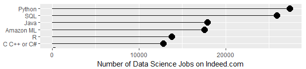
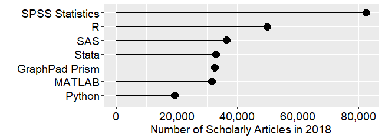
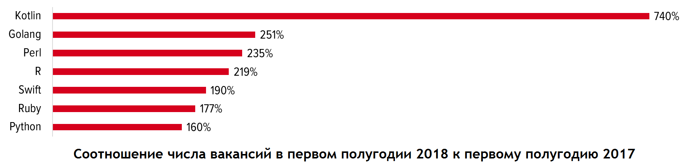

---
output:
  xaringan::moon_reader:
    css: ["./css/guu-slides-theme.css"]
    seal: false
    nature:
      ratio: '16:9'
      countIncrementalSlides: false
---

```{r setup, include=FALSE}
options(htmltools.dir.version = FALSE)

library('icon')
```

class: inverse, center, middle  
background-image: url(./images/title_GERB-GUU_16-9.png)
background-size: cover

## Практикум на ЭВМ 4

### Светлана Андреевна Суязова (Аксюк) </br> [s.aksuk@kiber-guu.ru](mailto:s.aksuk@kiber-guu.ru)  

4 сентября 2019

---

## Занятие 1

- "Введение в язык статистической обработки данных `R`"  
- 1 семестр с зачётом
- балльно-рейтинговая система   

.pull-left[.center[

]]

.pull-right[.center[

]]

---

## R - это  

`r icon::fa("rocket", color = "#1E8449")` язык статистической обработки и визуализации данных

--

`r icon::fa("database", color = "#34495E")` интерфейсы для чтения и сбора данных  

--

`r icon::fa("box-open", color = "#E74C3C")` постоянно пополняемая база пакетов   

--

`r icon::fa("chart-bar", color = "#6C3483")` инструменты для создания отчётов, презентаций, веб-приложений (`knitr`, `shiny`, `xaringan`)  

--

`r icon::fa("window-restore", color = "#424949")` IDE на выбор: RStudio, Vim, Emacs + ESS, Jupyter Notebook, Revolution R Enterprise, etc.  

---

В 2017 ‒ 2019 гг. `R` на пятом месте среди инструментов Data Science, данные поисковика работы по всему миру indeed.com   



<font size = "4px">
Источник: <a href = "http://r4stats.com/articles/popularity/">The Popularity of Data Science Software, r4stats.com</a>
</font>

---

В 2018 гг. `R` на втором месте по использованию в академических исследованиях (упоминания в Google Scholar) 



<font size = "4px">
Источник: <a href = "http://r4stats.com/articles/popularity/">The Popularity of Data Science Software, r4stats.com</a>
</font>

---

На hh.ru количество вакансий с упоминанием `R` в 2018 году выросло на 218% к прошлому году и составило 947.   



<font size = "4px">
Источник: <a href = "https://habr.com/ru/company/hh/blog/418079/">Наиболее востребованные языки программирования – 2018, habr.com</a>
</font>

---

## Содержание курса  

- типы и структуры данных, синтаксис, интерфейс RStudio  
- базовая графика  
- пользовательские функции  
- интерактивные отчёты на Rmarkdown, публикация скриптов и отчётов на rpubs.com и github.com   
- предварительный анализ данных (кросс-секционная выборка) 
- линейные регрессионные модели: идентификация, исследование остатков, прогноз    
---

## Материалы    

- Суязова С. А. Введение в язык статистической обработки данных R : учебное пособие. ‒ М.: ГУУ, 2018.   

- Методические указания к выполнению лабораторных работ по дисциплине "Практикум на ЭВМ 4". ‒ М.: ГУУ, 2019.  

- сайт дисциплины: <a href = "http://bit.ly/Rrr2019">bit.ly/Rrr2019</a>

---

## Практика №1: основы   

Особенности работы в R:   

`r icon::fa("check-square", color = "#1E8449")` функции в основе всего   

--

`r icon::fa("check-square", color = "#1E8449")` все объекты сессии хранятся в оперативной памяти   

--

`r icon::fa("check-square", color = "#1E8449")` по умолчанию параллельные вычисления не поддерживаются   

--

`r icon::fa("check-square", color = "#1E8449")` текстовые результаты выводятся в консоль   

--

`r icon::fa("check-square", color = "#1E8449")` графические результаты выводятся во встроенный просмотрщик, либо в файл    

---

### Типы переменных    

- числовой, целый: `integer`   
- числовой, с плавающей **точкой**: `double`   

.pull-left[
```{r}
typeof(42)
is.integer(42)
```
]
.pull-right[
```{r}
typeof(integer(42))
typeof(6.5)
```
]

---

### Типы переменных    

- текстовый: `characer`  

```{r}
typeof("Практикум на ЭВМ 4")
typeof('Дисциплина "Практикум на ЭВМ 4"')
typeof('42')
```

---

### Типы переменных    

- логический: `logical`  

`F` равносильно `FALSE`, `T` равносильно `TRUE`  

```{r}
2 == '2'
'осень' != 'лето'
```

---

### Структуры данных  

**Вектор** – одномерный набор элементов одного типа,  
нумерация элеменов с единицы. Функция `c()` – от **c**oncatenate.   

.pull-left[
```{r}
x <- c(1, 1, 2, 3)
typeof(x)

y <- c(TRUE, 1, '2', "3")
typeof(y)
```
]
.pull-right[
```{r}
x == y
```
]

---

### Структуры данных  

**Матрица** – вектор с двумя измерениями.   

```{r}
x.matrix <- matrix(c(1, 2, 3, 4, 5, 6), 2, 3)

x.matrix

dim(x.matrix)
```

---

### Структуры данных  

**Список** – одномерный набор элементов, типы м.б. разными.   

```{r}
my.list <- list(index.name = "ВВП РФ, трлн долл.", 
       year = 2014:2017, value = c(2.06, 1.37, 1.28, 1.58))
my.list
```

---

### Структуры данных  

**Фрейм данных** (`data.frame`) – таблица с показателями-столбцами (векторы) и наблюдениями-строками, **список векторов**.  

```{r}
df.2019 <- data.frame(city = c("Москва", "Воронеж",
                                 "Липецк"),
                   popul.mln = c(12.5, 1.1, 0.6),
                   area.sq.km = c(2561.5, 596.51, 330.15))
df.2019
```

---

### Структуры данных: фрейм    

```{r}
str(df.2019)
colnames(df.2019)
```

---

### Структуры данных: фрейм 

```{r}
df.2019 <- data.frame(city = c("Москва", "Воронеж",
                                 "Липецк"),
                   popul.mln = c(12.5, 1.1, 0.6),
                   area.sq.km = c(2561.5, 596.51, 330.15),
                   stringsAsFactors = F)
str(df.2019)
```

---

### Базовые операторы   

Присваивание справа налево:  `<-`, сочетание **Alt + "-"**  

Выбор элемента: `[]` 

Выбор элемента списка: `$`  

```{r}
df.2019$city
df.2019$city[1]
```

---

### Базовые операторы: `[]`   

```{r}
df.2019[1, ]   # выбрать первую строку фрейма 
df.2019[, 1]   # выбрать первый столбец фрейма
df.2019[1, 2]  # выбрать элемент из строки 1, столбца 2
```

---

### Базовые операторы: `[]`   

```{r}
df.2019[, 2:3] # выбрать второй и третий столбцы фрейма
df.2019[, c('popul.mln', 'area.sq.km')] #по именам столбцов
```

---

### Ключевые приёмы   

**Векторизация** – применение функции (оператора) ко всем элементам вектора   

```{r}
# проверить, в каких городах население больше миллиона
df.2019$popul.mln > 1
# номера элементов вектора, удовлетворяющих условию
which(df.2019$popul.mln > 1)
```

---

### Ключевые приёмы: векторизация  

```{r}
x <- c(1, -2, 3, -4)
# увеличить все элементы вектора на 1
y <- x + 1
# вывести результат
y 

# увеличить только положительные элементы вектора на 2
x[x > 0] <- x[x > 0] + 2
# вывести результат
x
```

---

### Ключевые приёмы  

- Семейство `apply()`: применение функции к элементам списка      

```{r}
apply(df.2019[, 2:3], 2, mean)
sapply(df.2019[, 2:3], mean)
```

---

### Ключевые приёмы: `apply()`  

```{r}
lapply(df.2019, mean)
```

---

### Ключевые приёмы   

- **Работа с документацией**   

```{r, eval = F}
# вызов справки по функции apply 
?apply

# поиск по сайту проекта (открывается в браузере)
RSiteSearch('apply')
```

больше миллиона вопросов с тегом `[r]` на stackoverflow.com: [stackoverflow.com/questions/tagged/r](https://stackoverflow.com/questions/tagged/r)

---

### Распространённые ошибки

```{r, eval = F}
с(1, 2, 3, 4)
```
`Error in с(1, 2, 3, 4) : could not find function "с"`

```{r}
df.2019$city
```

```{r, eval = F}
sum(df.2019$city)
```

`Error in sum(df.2019$city) : invalid 'type' (character) of argument`

---

### Практическая часть занятия  

- Прочитать главы 1-2 учебного пособия "Введение в язык статистической обработки данных R", повторить все примеры.   

- Приступить к выполнению упражнений 1-4. Номер варианта - ваш номер в списке группы.   

.center[

<font size = "4px">image credit: krman009@github.com</font>
]
